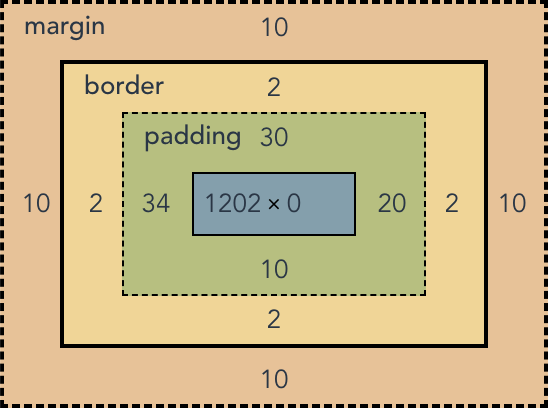

```bash
此项目是一个css盒模型 在页面视图中以盒模型的特性去修改盒模型的参数
```




### 安装
```bash
$ npm install xxo --save
$ yarn add xxo
```


### 引入
```javascript
// main.js
import xxo from 'xxo'
Vue.use(xxo)
```

### 使用 (只对行内属性生效)

>
>
> `dom-id` 获取哪个dom的盒模型 取的值为**id**
>
> `v-model` 返回你修改后的style(只返回修改过的,标签行内的样式不返回)
>

```vue
<template>
  <div style="margin:20px;padding:10px 54px 4px 3px;border: 3px solid #000; background:red;" id="text-model"></div>
  <xxo-box-model dom-id="text-model" v-model="getStyle"></xxo-box-model>
  {{ getStyle }}
</template>

<script>
export default {
  data(){
    return {
      getStyle:'',
    }
  },
}
</script>
```